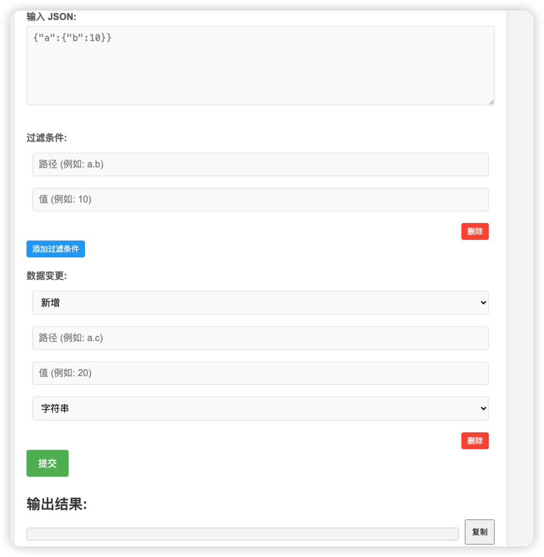

项目功能：对json数据进行替换</br>
项目地址：http://localhost:9100 </br>
项目页面：</br>


使用教程：

1. 在 输入框内输入原始json数据
2. 配置过滤条件；过滤条件可以分为两部分,第一部分是路径 ,格式是 a.b 多层次间字段通过.分割
   第二部分是值,含义是录入上字段的值。通过这两部分确定json的层次, 比如路径是 a.b 值是20 ,匹配到json层次是

```json
{
  "a": {
    "b": 10
  }
}
```

可以配置多个过滤条件
第二组的过滤条件是在第一组匹配到的json层级下进行过滤

3. 配置数据变更
   在下拉框内可以选择 新增、删除、修改
   填写 键、值、值的类型 就能对符合过滤条件的json进行修改
4. 点击提交后,输出结果就会回显出修改后的json,点击复制就可以直接复制到剪切板上